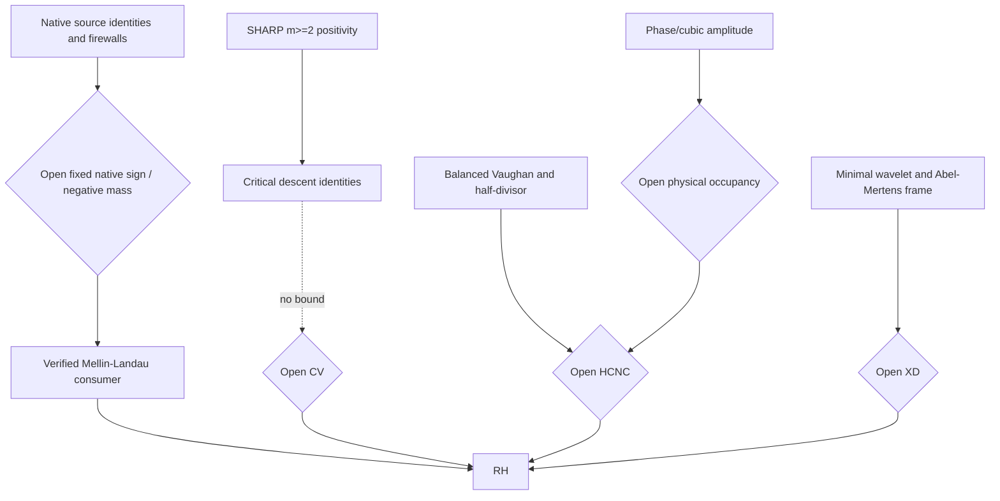
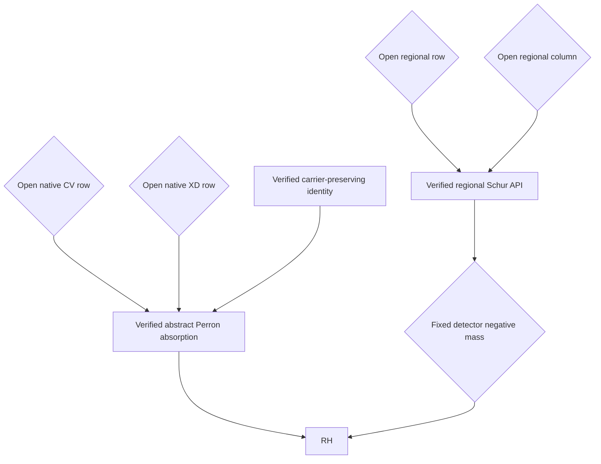
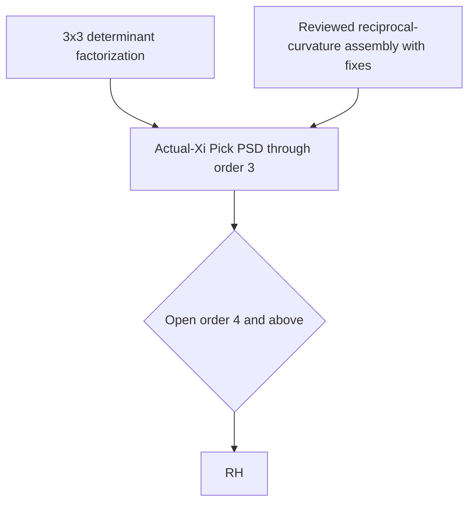

# Typed proof graph

## Machine verdict

```text
PROVEN_ONLY_PATH_TO_RH: false
CLAIMS:                 139
EDGES:                  36
ALIASES:                19
UNRESOLVED_CONFLICTS:   0
```

The graph is fail-closed. Every premise is a registered semantic node. Hyperedge premises are encoded as JSON arrays. A verified analytic consumer does not reach RH unless its distinct open arithmetic premise is explicitly supplied.

## Legend

- `VERIFIED` / `VERIFIED_WITH_FIXES`: reviewed theorem at the stated scope.
- `CONDITIONAL_EXACT`: exact implication or reduction with explicit premises.
- `OPEN_SUFFICIENT_FOR_RH`: open statement sufficient for the conclusion.
- `OPEN_RH_EQUIVALENT`: open statement equivalent to RH or to a complete RH criterion.
- `GAP_BLOCKED`, `FALSE`, `REFUTED_MECHANISM`: inactive in proved reachability.

## Leading arithmetic graph



## Conjunctive routes



These diagrams show interfaces, not established proof paths.

## Actual-Xi route



## Complete edge registry

| Edge | Verdict | Premises | Conclusion | First missing premise | Role |
|---|---|---|---|---|---|
| `EDGE.MELLIN.ROWS23` | `CONDITIONAL_EXACT` | `["CONSUMER.MELLIN.FIXED_ROW","CONSUMER.MELLIN.TWO_ROW","CONSUMER.MELLIN.SPECIALIZED_LANDAU","OPEN.ARITH.ROWS23_NATIVE"]` | `RH` | `OPEN.ARITH.ROWS23_NATIVE` | conclusion consumer |
| `EDGE.MELLIN.FIVE_THREE` | `CONDITIONAL_EXACT` | `["CONSUMER.MELLIN.FIVE_THREE","CONSUMER.MELLIN.SPECIALIZED_LANDAU","OPEN.ARITH.FIVE_THREE_NEGATIVE_MASS"]` | `RH` | `OPEN.ARITH.FIVE_THREE_NEGATIVE_MASS` | conclusion consumer |
| `EDGE.MELLIN.NEGATIVE_MASS` | `CONDITIONAL_EXACT` | `["API.MELLIN.SUBPOWER_NEGATIVE_MASS","OPEN.ARITH.FIXED_DETECTOR_NEGATIVE_MASS"]` | `RH` | `OPEN.ARITH.FIXED_DETECTOR_NEGATIVE_MASS` | conclusion consumer |
| `EDGE.MELLIN.ANNULAR` | `CONDITIONAL_EXACT` | `["CONSUMER.MELLIN.ANNULAR_ROWS23","CONSUMER.MELLIN.SPECIALIZED_LANDAU","OPEN.ARITH.ROWS23_NATIVE"]` | `RH` | `OPEN.ARITH.ROWS23_NATIVE` | annular conclusion consumer |
| `EDGE.MELLIN.MOVING_ROW_FALSE` | `FALSE` | `["CONSUMER.MELLIN.MOVING_ROW_SELECTION"]` | `RH` | `CONSUMER.MELLIN.MOVING_ROW_SELECTION` | dead mechanism |
| `EDGE.NATIVE.FCHD` | `CONDITIONAL_EXACT` | `["ARITH.SHARP.SEQUENTIAL_FIRST_OWNER","OPEN.ARITH.FCHD67"]` | `OPEN.ARITH.ROWS23_NATIVE` | `OPEN.ARITH.FCHD67` | native producer |
| `EDGE.NATIVE.ALPHA_FALSE` | `FALSE` | `["ARITH.SHARP.COMPACT_HALL_RN","ARITH.SHARP.ALPHA_NATIVE_PROMOTION"]` | `OPEN.ARITH.ROWS23_NATIVE` | `ARITH.SHARP.ALPHA_NATIVE_PROMOTION` | dead source mechanism |
| `EDGE.SHARP.POWERS_TO_CV` | `GAP_BLOCKED` | `["ARITH.SHARP.POWER_M_GE_2","ARITH.SHARP.CRITICAL_DESCENT_IDENTITIES"]` | `OPEN.ARITH.CV` | `OPEN.ARITH.CV` | not a proved edge |
| `EDGE.CV.RH` | `OPEN_RH_EQUIVALENT` | `["OPEN.ARITH.CV"]` | `RH` | `OPEN.ARITH.CV` | RH-equivalent criterion |
| `EDGE.WAVELET.CRITICAL_TO_RH` | `OPEN_RH_EQUIVALENT` | `["ARITH.WAVELET.SPECTRAL_ABSCISSA","OPEN.ARITH.XD"]` | `RH` | `OPEN.ARITH.XD` | RH-equivalent criterion |
| `EDGE.XD.OLD_K0K1` | `FALSE` | `["ARITH.XD.OLD_K0_K1_EDGE"]` | `OPEN.ARITH.XD` | `ARITH.XD.OLD_K0_K1_EDGE` | inactive historical edge |
| `EDGE.XD.SAME_K1` | `OPEN_RH_EQUIVALENT` | `["ARITH.XD.SAME_K1_TRANSLATION","OPEN.ARITH.XD"]` | `RH` | `OPEN.ARITH.XD` | corrected XD coordinate |
| `EDGE.HASSE.WAVELET_ALIAS` | `VERIFIED_WITH_FIXES` | `["ARITH.HASSE.WAVELET_REALIZATION","ARITH.WAVELET.MINIMAL_RATIO8"]` | `ARITH.XD.SAME_K1_TRANSLATION` | `` | alias |
| `EDGE.DICKMAN.CORRIDOR` | `GAP_BLOCKED` | `["ARITH.DICKMAN.STIELTJES_TRANSFER","ARITH.DICKMAN.MESOSCOPIC_BELLMAN"]` | `OPEN.ARITH.FCHD67` | `OPEN.ARITH.FCHD67` | live route |
| `EDGE.DICKMAN.FIXED_EXPONENT` | `GAP_BLOCKED` | `["ARITH.DICKMAN.FIXED_EXPONENT_INTERVALS"]` | `OPEN.ARITH.FCHD67` | `ARITH.DICKMAN.FIXED_EXPONENT_INTERVALS` | not yet active |
| `EDGE.VAUGHAN.NEAR_COLLISION` | `CONDITIONAL_EXACT` | `["ARITH.VAUGHAN.LARGE_DIVISOR","ARITH.VAUGHAN.HALF_DIVISOR","ARITH.VAUGHAN.HAAR_GRAM_DIAGONAL","OPEN.ARITH.HCNC"]` | `RH` | `OPEN.ARITH.HCNC` | half-divisor route |
| `EDGE.BPOE.HCNC` | `OPEN_SUFFICIENT_FOR_RH` | `["ARITH.PHASE.CUBIC_AMPLITUDE","OPEN.ARITH.BPOE"]` | `OPEN.ARITH.HCNC` | `OPEN.ARITH.BPOE` | physical occupancy route |
| `EDGE.BPOE.RH` | `OPEN_SUFFICIENT_FOR_RH` | `["ARITH.PHASE.CUBIC_AMPLITUDE","OPEN.ARITH.BPOE","ARITH.VAUGHAN.HALF_DIVISOR"]` | `RH` | `OPEN.ARITH.BPOE` | highest-priority arithmetic open route |
| `EDGE.CONJ.PERRON` | `OPEN_SUFFICIENT_FOR_RH` | `["API.PERRON.ABSORPTION","OPEN.CONJ.PERRON_CV_ROW","OPEN.CONJ.PERRON_XD_ROW","ARITH.CVXD.CARRIER_PRESERVATION"]` | `RH` | `OPEN.CONJ.PERRON_CV_ROW\|OPEN.CONJ.PERRON_XD_ROW` | minimal conjunctive cut |
| `EDGE.CONJ.REGIONAL_SCHUR` | `OPEN_SUFFICIENT_FOR_RH` | `["API.CONJUNCTIVE.REGIONAL_SCHUR","OPEN.CONJ.REGIONAL_ROW","OPEN.CONJ.REGIONAL_COLUMN"]` | `OPEN.ARITH.FIXED_DETECTOR_NEGATIVE_MASS` | `OPEN.CONJ.REGIONAL_ROW\|OPEN.CONJ.REGIONAL_COLUMN` | abstract AND gate |
| `EDGE.CONJ.MATCHED_TRANSFER` | `OPEN_SUFFICIENT_FOR_RH` | `["API.CONJUNCTIVE.MATCHED_TRANSFER","OPEN.CONJ.QMT","OPEN.CONJ.AMT"]` | `OPEN.ARITH.FIXED_DETECTOR_NEGATIVE_MASS` | `OPEN.CONJ.QMT\|OPEN.CONJ.AMT` | carrier-preserving AND gate |
| `EDGE.CONJ.ROOT_EXCESS` | `OPEN_SUFFICIENT_FOR_RH` | `["API.CONJUNCTIVE.ROOT_EXCESS","OPEN.CONJ.SORR","OPEN.CONJ.RFCP"]` | `RH` | `OPEN.CONJ.SORR\|OPEN.CONJ.RFCP` | two-key scalar quotient |
| `EDGE.CONJ.STAIRCASE` | `OPEN_SUFFICIENT_FOR_RH` | `["ARITH.STAIRCASE.VECTOR_REDUCTION","OPEN.ARITH.CFBB"]` | `RH` | `OPEN.ARITH.CFBB` | carrier-free vector route |
| `EDGE.CONJ.SPARSITY_ENERGY` | `CONDITIONAL_EXACT` | `["API.CONJUNCTIVE.SPARSITY_ENERGY"]` | `OPEN.ARITH.FIXED_DETECTOR_NEGATIVE_MASS` | `OPEN.ARITH.FIXED_DETECTOR_NEGATIVE_MASS` | inequality only |
| `EDGE.XI.ORDER3` | `VERIFIED_WITH_FIXES` | `["OPERATOR.XI.PICK_ORDER3.DETERMINANT","OPERATOR.XI.PICK_ORDER3.TP_CURVATURE","OPERATOR.XI.RECIPROCAL_CONCAVITY.ACTUAL"]` | `OPERATOR.XI.PICK_ORDER3` | `` | standalone unconditional theorem |
| `EDGE.XI.ALL_PACKETS_RH` | `OPEN_RH_EQUIVALENT` | `["OPERATOR.XI.PICK_ORDER3","OPEN.OPERATOR.XI.PICK_ORDER4_PLUS"]` | `RH` | `OPEN.OPERATOR.XI.PICK_ORDER4_PLUS` | countable RH criterion |
| `EDGE.XI.FRACTIONAL_GROWING` | `GAP_BLOCKED` | `["OPERATOR.XI.FRACTIONAL_STRING_FIXED_ORDER","OPERATOR.XI.FRACTIONAL_STRING_GROWING_ORDER"]` | `OPEN.OPERATOR.XI.PICK_ORDER4_PLUS` | `OPERATOR.XI.FRACTIONAL_STRING_GROWING_ORDER` | inactive route |
| `EDGE.SAFE_LINE.RADIAL_RH` | `OPEN_RH_EQUIVALENT` | `["OPEN.OPERATOR.RADIAL_CURVATURE"]` | `RH` | `OPEN.OPERATOR.RADIAL_CURVATURE` | RH-equivalent criterion |
| `EDGE.SUZUKI.AMPLITUDE` | `CONDITIONAL_EXACT` | `["OPERATOR.SUZUKI.AMPLITUDE_EMBEDDING"]` | `API.SUZUKI.FOCK_FIRST_CHAOS` | `API.SUZUKI.FOCK_FIRST_CHAOS` | conditional API |
| `EDGE.SUZUKI.RH` | `OPEN_RH_EQUIVALENT` | `["OPERATOR.SUZUKI.AMPLITUDE_EMBEDDING","API.SUZUKI.FOCK_FIRST_CHAOS","OPEN.OPERATOR.SUZUKI_FIRST_CHAOS_DOMINATION"]` | `RH` | `OPEN.OPERATOR.SUZUKI_FIRST_CHAOS_DOMINATION` | operator RH gate |
| `EDGE.CARRY.WEIGHTED_RESPONSE` | `OPEN_SUFFICIENT_FOR_RH` | `["ARITH.CARRY.FACTOR64_PAYMENT","OPEN.ARITH.CARRY_WEIGHTED_RESPONSE"]` | `RH` | `OPEN.ARITH.CARRY_WEIGHTED_RESPONSE` | critical-hinge coordinate |
| `EDGE.FACTOR67.GPC_CPSL` | `OPEN_RH_EQUIVALENT` | `["OPEN.ARITH.FACTOR67_GPC_CPSL"]` | `RH` | `OPEN.ARITH.FACTOR67_GPC_CPSL` | factor-67 scalar coordinate |
| `EDGE.C4MBI.BOUNDARY` | `OPEN_SUFFICIENT_FOR_RH` | `["OPEN.ARITH.C4MBI_BOUNDARY"]` | `RH` | `OPEN.ARITH.C4MBI_BOUNDARY` | C4MBI route |
| `EDGE.DIRECTMAIN.CJHI` | `OPEN_RH_EQUIVALENT` | `["DIRECTMAIN.CJ.LOCAL_IDENTITIES","OPEN.DIRECTMAIN.CJHI"]` | `RH` | `OPEN.DIRECTMAIN.CJHI` | direct-main operator route |
| `EDGE.DIRECTMAIN.MELLIN.ALL_ROWS` | `CONDITIONAL_EXACT` | `["DIRECTMAIN.MELLIN.L96000","DIRECTMAIN.MELLIN.L96001","CONSUMER.MELLIN.SPECIALIZED_LANDAU","OPEN.DIRECTMAIN.MELLIN.ALL_ROWS"]` | `RH` | `OPEN.DIRECTMAIN.MELLIN.ALL_ROWS` | historical direct-main Mellin route |
| `EDGE.DIRECTMAIN.TAYLOR.CRITICAL` | `OPEN_RH_EQUIVALENT` | `["DIRECTMAIN.TAYLOR.L99932_KERNEL","API.MELLIN.SUBPOWER_NEGATIVE_MASS","OPEN.DIRECTMAIN.TAYLOR_CRITICAL"]` | `RH` | `OPEN.DIRECTMAIN.TAYLOR_CRITICAL` | critical Taylor coordinate |

The authoritative table is [`integration/2026-08-22/EDGES.tsv`](integration/2026-08-22/EDGES.tsv), validated by [`integration/2026-08-22/validate_integration.py`](integration/2026-08-22/validate_integration.py).
