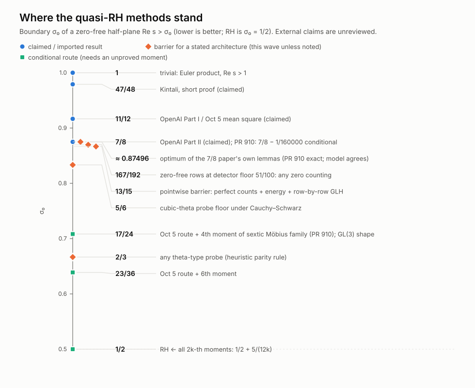

# Synthesis of the October 2026 quasi-RH research wave

```text
Status: EXPLORATORY synthesis (PROPOSED analyses, EMPIRICAL checks, IMPORTED claims); no RH claim
Scope: two external architectures for zero-free half-planes (OpenAI Sep 30 "7/8" and Oct 5 "11/12");
  their barriers and their scaling; bridges to this repository's programmes
Exact sources or dependencies: INTAKE.md; THRESHOLD_CALCULUS.md; FOURTH_MOMENT_A2.md; BRIDGE_MELLIN.md;
  CONDITIONAL_CONSEQUENCES.md; reports/REPO_RECENT_WORK.md; companion notes listed in Section 5;
  prior repository work: PRs 908, 909, 910 and branch claude/openai-math-riemann-analysis-w5copg
What was actually run: see each file's header
Smallest remaining gap: RH needs exponent 0 everywhere; the best imported claim gives 7/8 (3/8 excess)
```



*Figure: boundaries σ₀ of zero-free half-planes. Blue circles are claimed or imported results
(unreviewed). Orange diamonds are barriers for a stated architecture. Green squares are
conditional routes needing an unproved moment. Generated by `scripts/make_ladder_svg.py`.*

**RH remains unproved. Nothing here proves or disproves it.** The October 2026 manuscripts claim
*quasi*-RH (a zero-free half-plane `Re s > 7/8`) and are unreviewed. This wave asked what those
methods *can* and *cannot* do, and where a push could move the constant.

## 1. Two architectures, two very different scaling laws

| | Sep 30 "7/8" architecture | Oct 5 "11/12" architecture |
|---|---|---|
| core object | cubic-theta probe with three scales and prime slots; Poisson rows binned by zeros | sextic Möbius family `A_u(D)`, mean square over rows `u`, extraction at `u = p⁶` |
| what sets the constant | low (reflection) estimate `θ_low` | leverage of sixth-power rows (`c = 5/6`) times the moment order |
| scaling with better inputs | **stalls**: 13/15 even with perfect zero counts, perfect energy and row-by-row GLH; 5/6 floor for the probe family | **stalls at 11/12 for row-blind inputs**: the boundary is `1/2 + 5ρ/12` in the row/column ratio `ρ` alone, whatever the moment order; `ρ < 1` needs an on-average GRH for the family ([RUNG_STRENGTH.md](RUNG_STRENGTH.md)) |
| next rung | cross-row (ratios-type) cancellation, or a bilinear bound beating Cauchy–Schwarz | any sub-diagonal mean square; the simplest is the second moment over `D^ρ` rows, `ρ < 1` (`ρ < 9/10` beats 7/8) |

The Sep 30 architecture is the one that proves 7/8 today. The Oct 5 architecture's conclusion
improves continuously as the row/column ratio `ρ` falls below 1. That makes it look as if it
"tends to 1/2", but `ρ < 1` is exactly where row-blind methods stop.
* Any input reaching `ρ < 1` contains an on-average GRH for the sextic family.
* The family has a fixed point at its own conclusion
  ([RUNG_STRENGTH.md](RUNG_STRENGTH.md) §§3–4).
* The true moments are diagonal-sized at every tested `ρ` (numerics, finite). What is missing is a
  mechanism, not evidence.

## 2. What is new in this wave (all PROPOSED / EMPIRICAL; see files)

1. **Exact barrier certificates for the Sep 30 architecture.** These use rational LP duals.
   * Low estimate: `σ0 ≥ 13/15` in every geometry; the multipliers `(17/30, 2/5, 1/30)` cancel all
     geometry.
   * Zero-free floor rows: `σ0 ≥ 167/192` at the manuscript's detector floor `a0 = 51/100`, for any
     zero-counting input. As `a0 → 1/2` this becomes 13/15. This reconciles our 0.8698 with
     w5copg's "DH → 13/15".
   * 13/15 survives perfect energy and row-by-row GLH; contour flexibility does not help.
   * A bilinear saving `ϑ` on the reflected side gives `13/15 − 4ϑ/5`, down to 2/3 at `ϑ = 1/4`.
   * [THRESHOLD_CALCULUS.md](THRESHOLD_CALCULUS.md)
2. **Rigidity of 7/8.**
   * Re-optimizing the geometry gains `4·10⁻⁵`; this agrees with PR 910's exact limit.
   * Iterating the bootstrap from `β* ≤ 7/8` gains nothing.
   * Single moment constants (capacities, amplification slope) buy less than `5·10⁻⁴` each.
   * PR 910's joint moment (6.6), even granted on the whole detector range, buys at most
     `1/192`, because the floor rows then bind.
3. **The fourth moment has GL(3)-metaplectic shape.**
   * The dual coefficients of PR 910's fourth-moment target are `γ₂(d)γ₂(e)·conj((e/d)₃)` on
     coprime squarefree pairs.
   * This is the cubic A2 Weyl-group-multiple-Dirichlet-series pattern, i.e. Whittaker coefficients
     of cubic `GL(3)` Eisenstein series.
   * An exact nesting identity reduces it to the second-moment column sum at rows `h·d⁴`. Both
     identities were checked with exact sextic symbols.
   * The literature check confirms the shape exactly: `N(de)^{-1/2} H(d,e; h,h)` times a quadratic
     factor that lies outside every cubic WMDS. It also *closes* the reflection idea: the `GL(3)`
     cubic theta has `τ(m,1) = 0` off cubes, so it vanishes on the needed support. The missing
     input is an unconditional dispersion asymptotic, which is GRH-conditional even in `GL(2)`.
   * [FOURTH_MOMENT_A2.md](FOURTH_MOMENT_A2.md), [A2_LITERATURE.md](A2_LITERATURE.md).
3a. **The moment ladder is one statement** ([RUNG_STRENGTH.md](RUNG_STRENGTH.md)).
   * PR 910's `2k`-th moment boundary depends only on `ρ = h/k`: `1/2 + 5ρ/12`.
   * Row-blind bounds stop at `ρ = 1`, i.e. at 11/12.
   * A rigorous single-row proposition: Mom(k,h) ⇒ every member `L(s, ψ_u)` is zero-free in
     `Re s > 1/2 + h/(2k)`.
   * Numerics: the actual sextic moments `M₂`, `M₄`, `M₆` are diagonal-sized for
     `ρ ∈ [0.35, 2]`, `D ≤ 64000` ([moments/](moments/README.md)); the per-row statistics look
     complex-Gaussian.
4. **Bridges to this repository.** See [BRIDGE_MELLIN.md](BRIDGE_MELLIN.md) and
   [CONDITIONAL_CONSEQUENCES.md](CONDITIONAL_CONSEQUENCES.md).
   * Two-sided relative continuation (QRH) versus one-sided Landau (repo).
   * A graded Mellin lemma (premise exponent `θ` excludes zeros right of `1/2+θ`).
   * The graded NRC32 identity `limsup log S_Y/log Y = 4Θ − 2`.
   * A family-relative single step that would suffice for RH (RH-strength).
   * Under the imported claim, every RH-equivalent subpower premise here has exponent `3/8`
     instead of the trivial one; RH needs `0`.
5. **Kintali's 47/48 architecture** has closed form `max(11/12, 7/6 − 1/(2A))` in its density
   exponent `A`. It reaches 11/12 only with DH-quality Hecke density, and never below.
   * A bounded review found no error in the checked steps.
   * The first unverified step is Lemma 3 (weak reflection, App. B).
   * The cited density lemma is in Khale–O'Kuhn–Panidapu–Sun–Zhang (JNT 2021). Its sketchy proof
     can be repaired by citing Hinz (1976).
   * [reviews/KINTALI_REVIEW.md](reviews/KINTALI_REVIEW.md)
6. **Alternative probes.** A heuristic parity/budget rule says purely quadratic theta data never
   produce `μ`, so any theta-type probe has `σ0 ≥ 2/3`. Among cubic averaging patterns, 5/6 is
   minimal, and `m = 3` is forced for GL(2) covers. Quartic and sextic thetas could do better only
   if their unknown coefficient signs cooperate. See [ALT_PROBES.md](ALT_PROBES.md); HEURISTIC.
7. **Verification:** 53/53 exact checks of the 7/8 manuscript's stated arithmetic. Lemma 7.1's local Euler identity was checked for 77 primes with failing
   controls. Kintali's phase claims were checked exhaustively mod 36 ([numerics/](numerics/README.md)).
   The A2 dual off-diagonal is within 4% of its diagonal at tiny scale.

## 3. Where a breakthrough would have to come from (ranked)

1. **A sub-diagonal mean square of the sextic Möbius family (Oct 5 architecture).** This is the
   only identified input with unbounded leverage toward 1/2. The boundary is `1/2 + 5ρ/12`, so a
   *second* moment over `D^{0.9}` rows already gives 7/8 and anything below beats it.
   * The difficulty is the same at every moment order: an on-average GRH for the family, with
     small-conductor rows at a fixed point ([RUNG_STRENGTH.md](RUNG_STRENGTH.md)).
   * The `GL(3)` reflection idea is closed ([A2_LITERATURE.md](A2_LITERATURE.md)).
   * The fourth moment's A2 / bilinear structure is worth pursuing only if it supplies a dispersion
     asymptotic. No unconditional precedent exists even in `GL(2)`.
2. **Cross-row cancellation for zero-free rows (Sep 30 architecture).** A ratios-type average of
   `L(w, χ_u)/L(s, ηχ_u)` over the sextic family. With DH-quality counts, a floor saving `θ` gives
   `σ = max(13/15, (167−225θ)/(192−225θ))`, reaching 13/15 at `θ = 1/50`. Going below 13/15 needs
   savings in every bin *and* a better reflected energy, with floor 5/6 at `θ = 14/75`. No rigorous
   `θ > 0` is known; see [FLOOR_BIN_BARRIER.md](FLOOR_BIN_BARRIER.md).
3. **Bilinear saving on the reflected side (Sep 30).** Worth `4/5` per unit, uncapped down to 2/3
   in this model.
4. Everything else (moment constants, detector floor, joint moments, iteration) is capped at
   `≤ 1/120` by the certificates.

## 4. What this wave does **not** show

* It does not verify the manuscripts. Only their stated arithmetic and selected identities were
  checked.
* The barriers are barriers for the stated lemma outputs in the stated architecture. They are not
  theorems about the true size of any probe.
* The A2 identification is a coefficient-shape identification, not a theorem.
* No numerical finding here is a proof of any moment estimate.

## 5. Companion notes and their status

| File | Thread | Status |
|---|---|---|
| [INTAKE.md](INTAKE.md) | statements, architecture, ledger | IMPORTED + EXACT ledger |
| [THRESHOLD_CALCULUS.md](THRESHOLD_CALCULUS.md) | Sep 30 exponent model and barriers | PROPOSED + exact certificates |
| [FOURTH_MOMENT_A2.md](FOURTH_MOMENT_A2.md) | Oct 5 fourth moment ↔ cubic GL(3) | PROPOSED + EMPIRICAL identities |
| [RUNG_STRENGTH.md](RUNG_STRENGTH.md) | the ladder depends only on `ρ`; the `ρ = 1` wall; what `ρ < 1` must contain | PROPOSED + HEURISTIC barrier + EMPIRICAL |
| [A2_LITERATURE.md](A2_LITERATURE.md) | literature check of the A2 route | SURVEY + PROPOSED assessment |
| [BRIDGE_MELLIN.md](BRIDGE_MELLIN.md) | repo Mellin / NRC32 bridges | PROPOSED |
| [CONDITIONAL_CONSEQUENCES.md](CONDITIONAL_CONSEQUENCES.md) | graded lemma, corollaries, non-improvements | PROPOSED / CONDITIONAL |
| [reports/REPO_RECENT_WORK.md](reports/REPO_RECENT_WORK.md) | digest of PRs 901–910 and branches | SURVEY |
| other companion notes | floor-bin, alternative probes, zero density, numerics, moments, reviews | see README.md |
